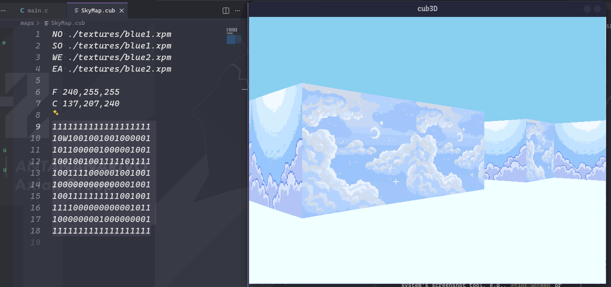

# Cub3D

A raycasting-powered first-person 3D maze explorer implemented in C with MiniLibX, offering textured walls and smooth player movement in a grid-based world, inspired by classic FPS games like Wolfenstein 3D.

## Features

- Raycasting engine for 3D rendering
- Texture mapping on walls
- Player movement and rotation
- Basic map parsing from .cub files
- Floor and ceiling color support

## Screenshots



## Requirements

- Linux operating system
- GCC compiler
- MiniLibX library (included in the project)
- X11 development libraries (`libx11-dev`, `libxext-dev`)

## Installation

1. Clone the repository:
   ```bash
   git clone https://github.com/EvernightA/cub3d.git
   cd cub3D
   ```

2. Compile the project:
   ```bash
   make
   ```

   This will build the `cub3D` executable.

## Usage

Run the game with a map file:

```bash
./cub3D maps/map1.cub
```

### Controls

- **WASD**: Move forward/backward and strafe left/right
- **Left/Right Arrow Keys**: Rotate the camera
- **ESC**: Quit the game

## Map Format

Maps are stored in `.cub` files with the following structure:

1. **Texture definitions** (required):
   ```
   NO ./path/to/north_texture.xpm
   SO ./path/to/south_texture.xpm
   WE ./path/to/west_texture.xpm
   EA ./path/to/east_texture.xpm
   ```

2. **Color definitions** (required):
   ```
   F R,G,B  # Floor color (RGB values 0-255)
   C R,G,B  # Ceiling color (RGB values 0-255)
   ```

3. **Map grid** (required):
   - `1`: Wall
   - `0`: Empty space
   - `W`: Player starting position (facing west)
   - Other directions: `N`, `S`, `E` for north, south, east respectively

Example map file:
```
NO ./textures/wall1.xpm
SO ./textures/wall1.xpm
WE ./textures/wall1.xpm
EA ./textures/wall1.xpm

F 0,0,0
C 0,0,0

1111111111111111111
10W1001001001000001
1011000001000001001
1001001001111101111
1001111000001001001
1000000000000001001
1001111111111001001
1111000000000001011
1000000001000000001
1111111111111111111
```

## Project Structure

```
cub3D/
├── Makefile              # Main build file
├── includes/
│   └── cub.h            # Header file with structures and prototypes
├── libft/               # Custom C library
│   ├── *.c              # Library source files
│   ├── libft.h          # Library header
│   └── Makefile         # Library build file
├── minilibx-linux/      # MiniLibX graphics library
│   ├── *.c              # MLX source files
│   ├── libmlx_Linux.a   # Compiled MLX library
│   └── Makefile         # MLX build file
├── maps/                # Map files
│   └── map1.cub         # Example map
├── screenshots/         # Screenshots directory
├── srcs/                # Main source files
│   ├── main.c           # Program entry point
│   ├── map_parsing.c    # Map file parsing
│   ├── parsing_utils.c  # Parsing utilities
│   ├── dda.c            # Digital Differential Analyzer for raycasting
│   ├── calculus.c       # Mathematical calculations
│   ├── moves.c          # Player movement handling
│   ├── mlx_utils.c      # MiniLibX utilities
│   ├── img.c            # Image handling
│   ├── texture_loading.c # Texture loading
│   ├── frees.c          # Memory cleanup
│   └── *.c              # Other utility files
├── textures/            # Texture files
│   └── wall1.xpm        # Example wall texture
└── README.md            # This file
```

## Building and Cleaning

- `make`: Compile the project
- `make clean`: Remove object files
- `make fclean`: Remove object files and executable
- `make re`: Rebuild the project

## Notes

- The project uses raycasting to simulate 3D graphics in a 2D grid-based world.
- Textures must be in XPM format.
- The map must be surrounded by walls (1s) to prevent rendering issues.
- Player starting position must be placed in an empty space (0) within the map boundaries.
